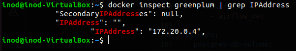
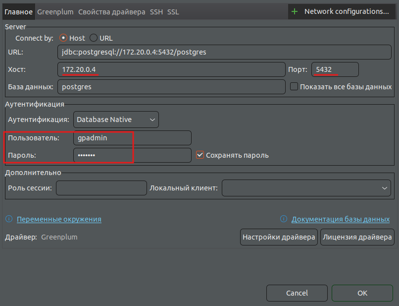
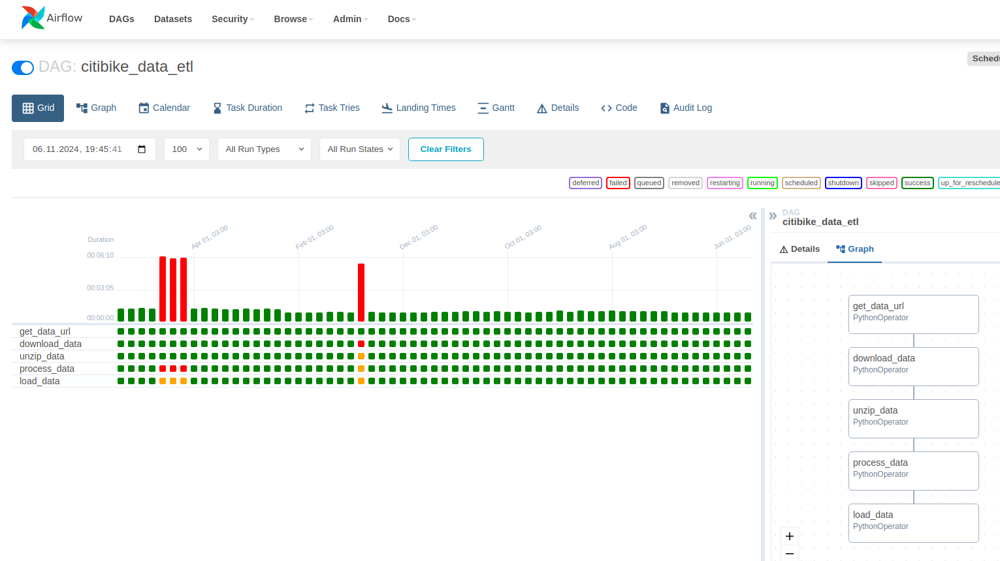
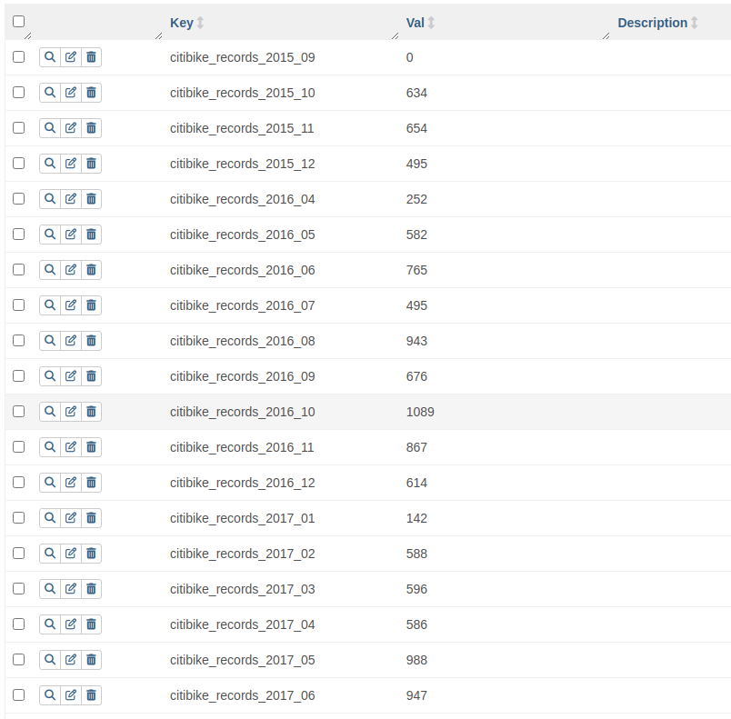

# Обработка информации с удаленных источников

Проект представляет собой ETL-процесс для загрузки и обработки данных о велопробегах с использованием Apache Airflow и Greenplum Database.

Требования

- Docker
- Docker Compose
- DBeaver (или другой SQL-клиент)

Архитектура

- Apache Airflow для оркестрации процессов
- Greenplum для хранения данных
- Python для обработки данных

## Установка и настройка

### Подготовка окружения

Создайте Docker сеть и необходимые директории:

```bash
docker network create airflow_greenplum_net
```

Откройте рабочую директорию проекта в терминале

```bash
mkdir -p ./dags ./logs ./plugins ./config
```

Дальше создаем файл `.env`:

```bash
echo -e "AIRFLOW_UID=$(id -u)" > .env
```

### Запуск Airflow

Необходимо убедиться, что файл `docker-compose.yaml` представленный в архиве находится в рабочей директории. Рабочую директорию открываем в терминале и запускаем Airflow, используя команду:

```bash
docker-compose -f docker-compose.yaml up airflow-init
```

После этого запускаем наш файл `docker-compose.yaml`, используя команду:

```bash
docker-compose -f docker-compose.yaml up
```

После успешного запуска веб-интерфейс Airflow будет доступен по адресу localhost:8080 (учетные данные: airflow/airflow).

### Настройка подключений

#### Airflow Connection

Создайте новое подключение в Airflow UI: `Admin` >> `Connection` >> `+`

- **Conn Id**: `greenplum`
- **Conn Type**: `Postgres`
- **Host**: `greenplum`
- **Schema**: `postgres`
- **Login**: `gpadmin`
- **Password**: `gpadmin`
- **Port**: `5432`

#### Database Connection

Получите IP-адрес Greenplum контейнера:

```bash
docker inspect greenplum | grep IPAddress
```



Используйте полученный IP-адрес для подключения через SQL-клиент.\


Остальные поля заполняем как и при подключении Airflow

### Инициализация базы данных

Для создания таблицы в СУБД `Greenplum` воспользуйтесь скриптом из файла `SQL_script.sql`

### Запуск ETL-процесса

1. Поместите файл citibike_data_etl.py в директорию ./dags
2. Активируйте DAG через веб-интерфейс Airflow

Данный DAG загружает файлы о  [велопробегах](https://s3.amazonaws.com/tripdata/index.html) с 9 сентября 2015 года по 9 сентября 2020 года.

Связано это с тем, что более современные csv-файлы имеют различные имена и значения полей, относительно более старых файлов.

После запуска DAGа можно увидеть следующий результат:



На изображении видно, что DAG не смог обработать 4 месяца. Это связано с ошибками источника данных.

Так, например, архив `JC-201708 citibike-tripdata.csv.zip` имеет пропущенную `-` в названии файла, что не позволяет загрузить его из удаленного источника.

Csv-файлы `JC-201601-citibike-tripdata.csv`, `JC-201602-citibike-tripdata.csv`, `JC-201603-citibike-tripdata.csv` имеют аналогичную проблему, связанную с наименованием файла.

Отчеты о загруженных записях доступны в переменных Airflow:
`Admin` >> `Variables`


